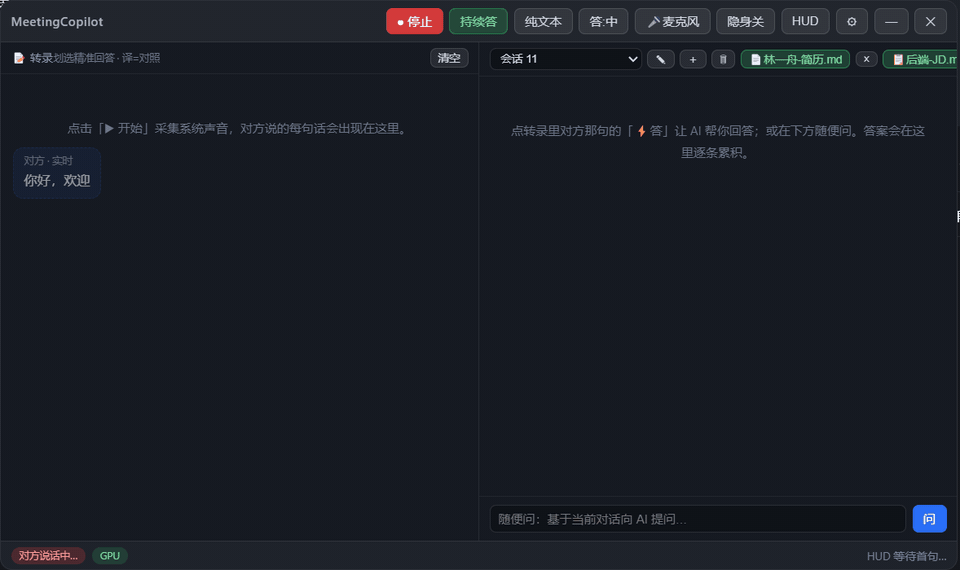
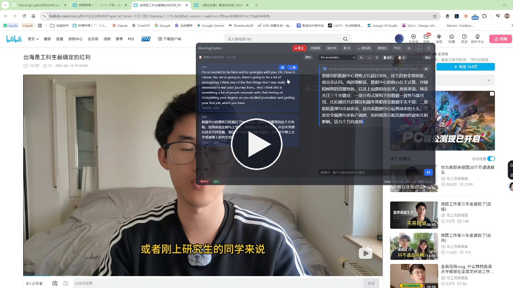
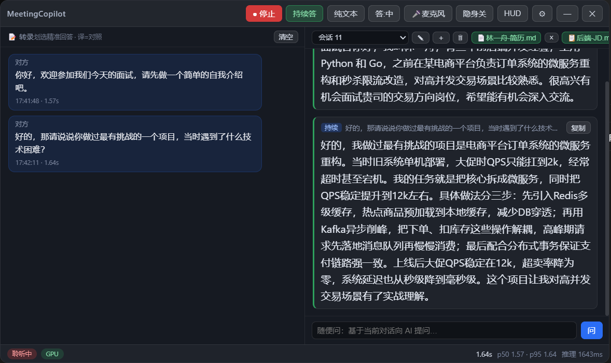
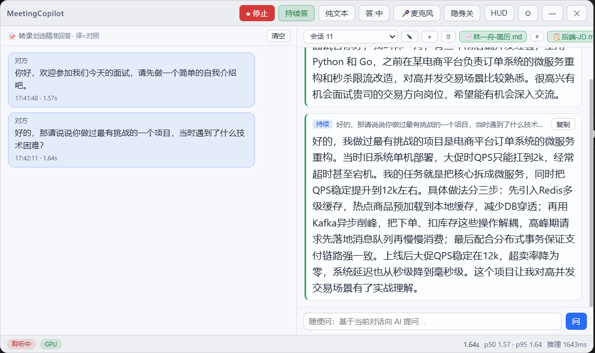
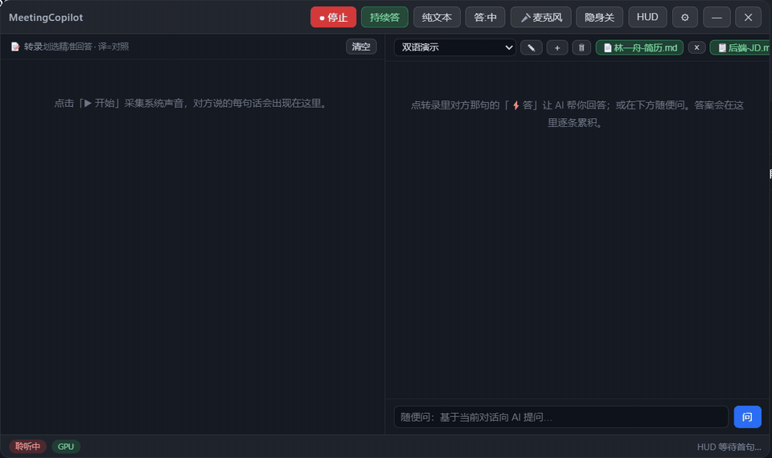
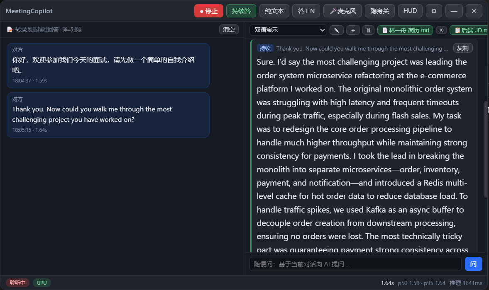
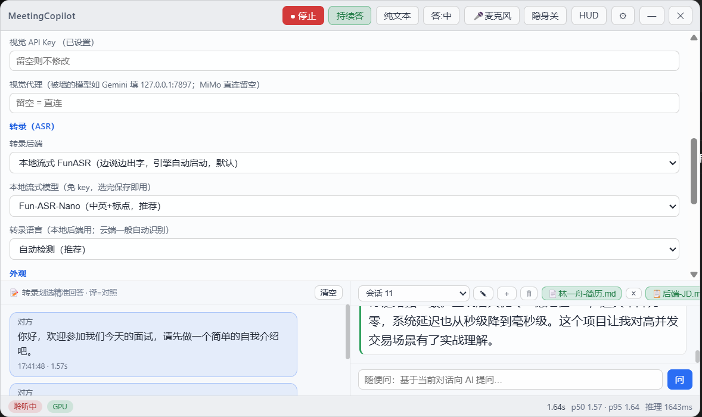

<div align="center">

# MeetingCopilot

**Windows / macOS 实时会议与面试助手**

实时转录对方说话 · 第一人称提词式回答 · 采集保护

<a href="https://github.com/JWM0203/MeetingCopilot/stargazers"></a>

<a href="https://github.com/JWM0203/MeetingCopilot"></a>
<a href="https://gitee.com/jwm0302/MeetingCopilot"></a>
<a href="https://www.xiaohongshu.com/discovery/item/6a50df530000000007020f79?source=webshare&xhsshare=pc_web&xsec_token=ABbqtJXWoEQSYl-hNrBxJbXeGEZWoH6YjnAYj97pjKEpo=&xsec_source=pc_share"></a>

[English](README.md) · [功能亮点](#功能亮点) · [快速开始](#快速开始) · [转录后端](#转录后端) · [协议](#协议)

</div>

---



*真实录屏（非摆拍）：面试官话还没说完，左栏灰色实时字幕已经跟上；说完自动触发右栏回答，内容严格贴合你的简历、可直接照着念。*

### 🎬 三分钟真实使用实录

[](docs/MeetingCopilot-demo.mp4)

*点击观看（带声音）：拿一个英文播客和一个中文视频当"对方"——中英双语实时转录、内联翻译、中英文自动回答，屏幕上实测端到端延迟 0.94 秒。*

## 功能亮点

- 🎧 **直接听对方的声音，不进会**：Windows 采集系统回环音频；macOS 使用可选择的音频输入（会议/系统声音可通过 BlackHole 等虚拟设备路由）。麦克风为独立通道，可单独转录你自己的发言。
- ⚡ **流式转录，四种后端随心切**：本地 FunASR 流式（默认，免费且隐私，Python 引擎由应用自动拉起回收）· 本地 Whisper turbo（离线兜底，DirectML GPU）· 阿里云 `fun-asr-realtime`（云端逐字流式）· MiMo 按段。说话中即出灰色实时字幕。
- 🌍 **中英双语开箱即用**：一场会里中英夹着说，转录自动识别语言切换，不用动任何设置；答案语言点一下 `答:EN` 就切成英文提词，照样贴合你的简历——外企英文面试直接用。
- 🧠 **第一人称提词式回答**：自带 key（BYOK），任何 OpenAI 兼容大模型均可（推荐 DeepSeek）。答案就是你能一字不改念出来的话——先结论后要点；行为题按 STAR 展开；技术题先思路再关键点、必要时给复杂度；绝不编造简历之外的经历。
- 📄 **简历 / 岗位 JD 双槽按会话导入**：支持 `.md/.txt/.docx/.pdf`，全部本地确定性解析、不上传。自动识别题型（行为 / 技术 / 寒暄）并附零延迟提示。
- 🔁 **滚动面试备忘**：每次回答后异步更新一份结构化备忘（已问问题 / 我已声称的事实 / 面试官关注点），一小时的面试前后不打架，每次请求的 token 数恒定不膨胀。
- 🚀 **前缀缓存预热**：点 ▶ 的同时发出一条 1-token 请求，提前建好大模型的 KV 前缀缓存，第一个真实问题直接命中（DeepSeek `prompt_cache_hit_tokens` 实测验证），采集期间自动保温。
- 🖼️ **框选截图问答**：拖框选中屏幕任意区域问视觉模型（MiMo / Gemini），框选层本身对录屏不可见。
- 🥷 **采集保护**：内容保护配合全局快捷键隐藏/呼出。Windows 可在受支持的采集方式中排除窗口；macOS 面对新版 ScreenCaptureKit 无法保证完全隐身。
- 🌗 **深色 / 浅色 / 跟随系统**三主题，答案区三档大字体，延迟 HUD，转录内联翻译，多会话隔离（每场会议独立的转录 + 对话 + 资料）。

| 深色 | 浅色 |
|---|---|
|  |  |

### 同一场会里的中英双语



*先一个中文问题、再一个英文问题——同一会话、零设置改动，本地转录自动识别语言切换（都在 1.6 秒左右上屏）；点一下 `答:EN`，英文答案照样严格贴合同一份简历。*



## 环境要求

| 组件 | 要求 |
|---|---|
| 操作系统 | Windows 10 / 11，或 Apple 芯片 macOS 14+ |
| 运行时 | Node.js ≥ 20 与 npm |
| 大模型 | 任意 OpenAI 兼容 API key——推荐 DeepSeek（快、便宜、带前缀缓存） |
| 本地流式转录（默认） | Python 3.10/3.11 + `funasr` + `torch`；支持 CUDA、Apple MPS 或 CPU 回退 |
| 本地 Whisper（离线兜底） | `whisper-large-v3-turbo` ONNX 权重；Windows 用 DirectML，其他平台用 CPU |
| 云端转录（可选） | 阿里云百炼（DashScope）key，或 MiMo key |

## 快速开始

```bash
git clone https://github.com/JWM0203/MeetingCopilot.git
cd MeetingCopilot
npm install        # postinstall 自动应用 patches/（transformers.js 补丁，勿删）
npm run build      # 构建 main + preload + renderer 到 out/
npm start          # 跨平台；Windows 也可使用 start.bat
```

首次使用：

1. 打开 **⚙ 设置** → 选 *DeepSeek* 预设 → 填入你的 API key → 保存。
2. 选转录后端（见下节）。默认的*本地流式 FunASR* 只需一次性配好 Python 环境；云端后端只要填 key。
3. 点 **▶ 开始**——对方说的每句话出现在左栏。点气泡上的 **⚡答**，或打开 **持续答** 让提问自动触发回答。
4. 点 **📄 / 📋** 导入你的简历和岗位 JD，回答会牢牢贴合你的真实经历。

> 🇨🇳 国内 npm / Electron 下载慢时，在项目根目录建 `.npmrc`：
> `registry=https://registry.npmmirror.com` 和
> `electron_mirror=https://npmmirror.com/mirrors/electron/`。

### macOS 音频

Electron 的 `audio: 'loopback'` 仅支持 Windows。macOS 点击 **▶** 并授权麦克风后，可在按钮旁选择输入设备。若要采集会议软件而不是内置麦克风，请把系统声音路由到
[BlackHole](https://github.com/ExistentialAudio/BlackHole) 等虚拟输入并选中它。对方通道会关闭回声消除、降噪和自动增益，避免破坏虚拟设备的 PCM；独立 🎤 通道仍保留正常麦克风处理。

## 转录后端

| 后端 | 延迟 | 费用 | 隐私 | 说明 |
|---|---|---|---|---|
| **本地 FunASR 流式**（默认） | ~1.2–1.8 s | 免费 | ✅ 完全本地 | `Fun-ASR-Nano`（中英双优+标点）或 `paraformer` 真流式（纯中文，字幕更跟手） |
| 本地 Whisper turbo | Windows 支持的 GPU 上约 2 s | 免费 | ✅ 完全本地 | Windows 用 DirectML；其他平台 CPU 回退 |
| 阿里云 `fun-asr-realtime` | 最佳 | 按量 | 云端 | 逐字流式，服务端断句带标点 |
| MiMo 按段 | ~1 s/段 | 按量 | 云端 | 简单的按句云端转录 |

### 本地流式 FunASR（默认）

```bash
conda create -n funasr python=3.10 -y
conda activate funasr
# 按你的显卡选 torch 版本（RTX 50 系示例为 cu128）：
pip install torch --index-url https://download.pytorch.org/whl/cu128
pip install funasr modelscope websockets numpy
```

Apple 芯片 Mac 已验证的项目内环境：

```bash
python3.11 -m venv .venv
.venv/bin/pip install -r requirements-funasr.txt
npm start
```

应用会自动发现 `.venv`。`--device auto` 依次尝试 CUDA、可用的 Apple MPS、CPU；加速器初始化失败会自动退回 CPU。应用只加载当前选中的一个 FunASR 模型，降低内存占用。

配好即用——应用会**自动拉起并回收**引擎（`tools/funasr_stream_server.py`，`ws://127.0.0.1:10097`）。当前选中的模型首次运行时从 ModelScope 自动下载（paraformer 约 880 MB，Nano 约 1.7 GB）。Python 装在别处时，设置环境变量 `MC_FUNASR_PYTHON` 指向完整路径即可。

### 本地 Whisper turbo

把 [`onnx-community/whisper-large-v3-turbo-ONNX`](https://huggingface.co/onnx-community/whisper-large-v3-turbo-ONNX) 放到 `%APPDATA%/MeetingCopilot/models/onnx-community/whisper-large-v3-turbo-ONNX/`（`encoder_model_fp16.onnx`、`decoder_model_merged_quantized.onnx` 及 config/tokenizer 等文件）。

### 云端

- **阿里云百炼**：地址 `wss://dashscope.aliyuncs.com/api-ws/v1/inference`，模型 `fun-asr-realtime` 或 `paraformer-realtime-v2`。
- **MiMo**：`https://api.xiaomimimo.com/v1`，模型 `mimo-v2.5-asr`。



## 开发

```bash
npm test            # 单元测试（prompt 组装 / VAD / 持久化 / 文档解析 / 流式协议）
npm run typecheck   # 双 tsconfig（主进程 + 渲染层）
npm run dev         # vite HMR 开发模式
node tools/rt-asr-smoke.mjs   # 流式转录协议冒烟（需设 MC_RT_URL / MC_RT_KEY）
```

架构一句话：Electron 主进程（窗口 / 隐身 / IPC / LLM 路由 / ASR 宿主）→ ASR 引擎全部跑在 **utilityProcess** 里（绝不进主进程——DirectML 推理在主进程会挂死）→ React 渲染层（左转录 + 右回答双栏）；所有状态存本地 JSON 文件，绝不用 DOM 存储。

## 隐私

- API key 使用 Electron `safeStorage`（Windows DPAPI / macOS Keychain）加密落盘，永远不进渲染进程。
- 全部数据位于 Electron 的用户数据目录（Windows：`%APPDATA%/MeetingCopilot/`；macOS：`~/Library/Application Support/MeetingCopilot/`）。无遥测、无账号、无服务器。
- 用本地转录后端时，音频不出你的电脑；大模型自带 key，转录文本只发给你自己配置的服务商。

## 免责声明

本工具面向个人学习与辅助用途。会议 / 面试中能否使用实时辅助，取决于你所在地的法律与对方的规则——使用本软件产生的一切后果由使用者自行承担。

## 协议

**Apache License 2.0 + Commons Clause**——**非商用**前提下可自由使用、修改、再分发；不允许销售本软件或以其功能为主要价值来源的服务。详见 [LICENSE](LICENSE)。
